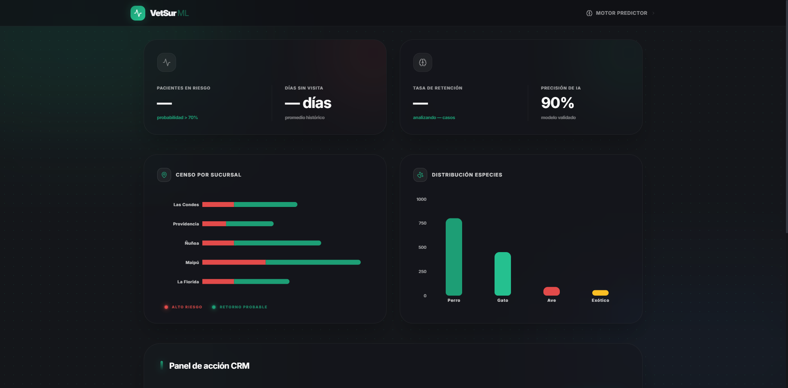
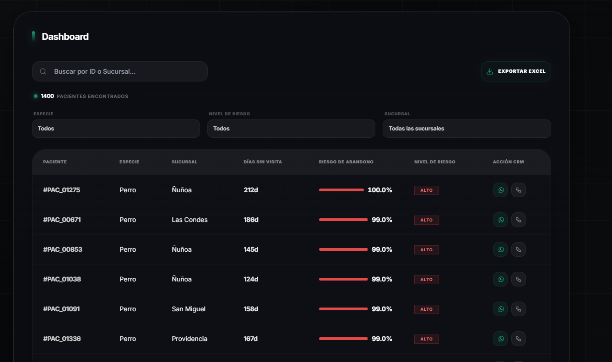
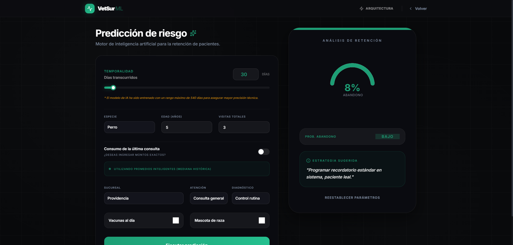
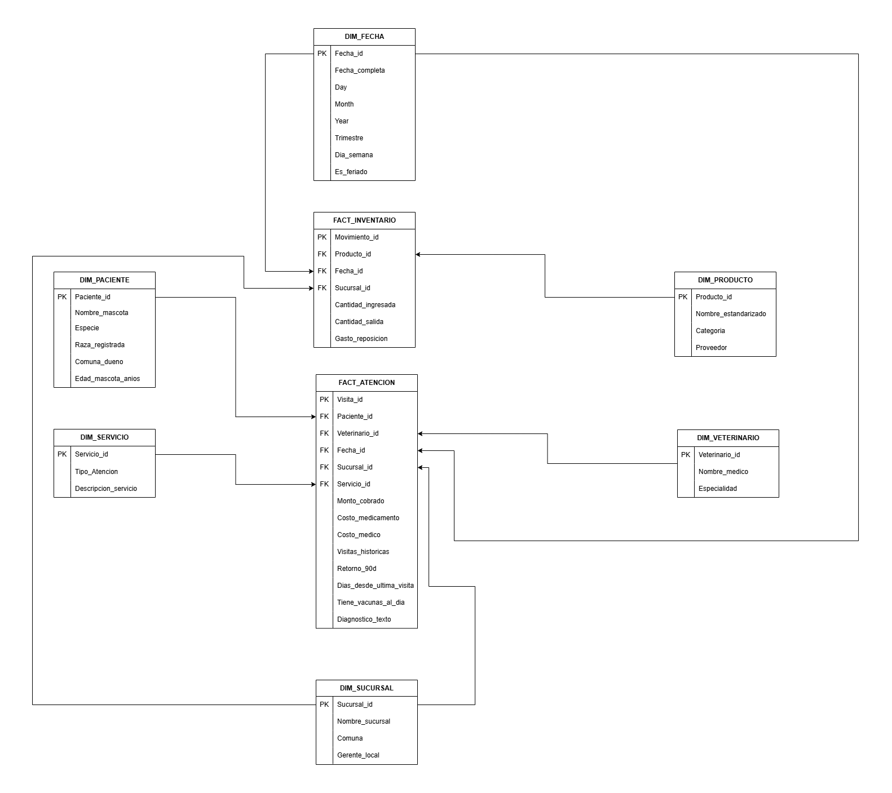
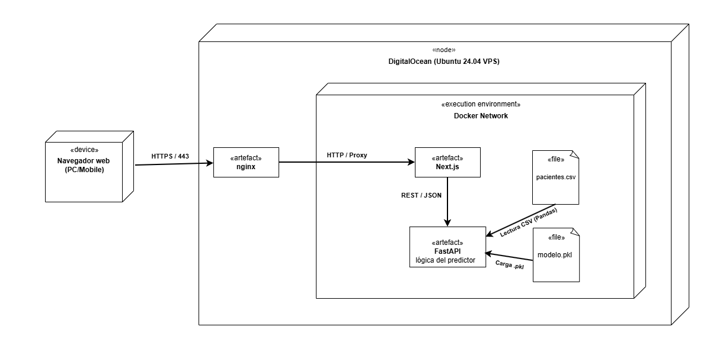

# 🐾 Vetsur: inteligencia de negocios y predicción de pacientes

<div align="center">

[](https://nextjs.org/)
[](https://fastapi.tiangolo.com/)
[](https://www.docker.com/)
[](https://scikit-learn.org/)
[](https://www.typescriptlang.org/)
[](https://github.com/features/actions)

### 🚀 [Acceder a la plataforma en vivo](https://vetsur.gbkjy.dev)

</div>

---

## El desafío del negocio
> **Nota:** este proyecto es un **ejercicio académico** basado en un caso de estudio para Vetsur Servicios Veterinarios SpA.

Vetsur enfrentaba un escenario crítico: a pesar de facturar aprox. $2.800 millones anuales, la empresa operaba "a ciegas" mediante metodologías de información locales. El objetivo de este proyecto es centralizar esa información y aplicar un ciclo de vida de datos basado en el paradigma **CRISP-DM**:

- **Entendimiento y preparación:** el proceso se inició con datos en bruto de **Excel**. Se utilizó **Google Colab** para la limpieza inicial y el análisis exploratorio.
- **Ingeniería de datos (ETL):** se diseñó un pipeline de transformación para convertir datos ruidosos en conocimiento útil, exportando las características en **JSON** y guardando los metadatos para la inferencia.
- **Modelado predictivo:** se entrenó un modelo de **Random Forest** para capturar patrones de comportamiento de los pacientes. El modelo final se guardó en formato **PKL**.
- **Despliegue de producto:** finalmente, se trasladó la lógica del notebook a una **arquitectura desacoplada**, separando el motor de lógica (API en FastAPI) de la interfaz de usuario para facilitar la consulta de predicciones.

## Vista de la plataforma
<p align="center">
  
  <br><br>
  
  <br><br>
  
</p>

## Proceso de ingeniería de datos (ETL)
En lugar de la eliminación de registros, se optó por reconstruir la lógica de los datos en el pipeline:
- **Normalización automatizada:** implementación de la librería `ftfy` para reparar la doble decodificación corrupta en variables categóricas.
- **Codificación categórica:** aplicación de **One-Hot Encoding** para transformar variables como especie, sucursal y tipo de atención en vectores numéricos procesables por el modelo.
- **Imputación estadística:** uso de la **mediana** como medida robusta frente a los valores atípicos encontrados en cirugías de alto costo.

## Modelado de datos (BI)
Se evolucionó de un esquema estrella a un **esquema de galaxia**, separando los hechos de atención de los movimientos de inventario:

<p align="center">
  
  <br>
  <em>Diagrama de modelado: separación de hechos de atención e inventario compartiendo dimensiones clave.</em>
</p>

## Modelado y hallazgos analíticos
Se evaluaron modelos de Regresión Lineal y Gradient Boosting, pero el modelo que mejor se adaptó a los datos fue **Random Forest**.

### Métricas clave del modelo
- **Precisión (accuracy):** 86%.
- **Exhaustividad (recall):** 91%. Se buscó maximizar el recall para minimizar los falsos negativos, ya que para Vetsur es más costoso perder un cliente en peligro de fuga que realizar un contacto preventivo innecesario.


## Despliegue continuo (CI/CD)
Se ha implementado un flujo automático para garantizar que el sistema sea fácil de mantener y actualizar:
- **Integración con Docker Hub:** las imágenes del frontend y backend se compilan y suben a un registro externo para no saturar recursos del VPS.
- **Automatización con GitHub Actions:** cada push a la rama principal dispara el proceso de build y validación.
- **Despliegue atómico:** el VPS descarga las imágenes nuevas y reinicia los contenedores solo si la compilación fue exitosa.

## Arquitectura de despliegue y stack tecnológico
<p align="center">
  
</p>

La plataforma funciona con una arquitectura de **servicios independientes**, e incluye una [sección de arquitectura interactiva](https://vetsur.gbkjy.dev/arquitectura) para explicar el flujo de datos.

- **Frontend (interfaz reactiva):**
    - **Framework:** Next.js 14 (App Router) con TypeScript.
    - **Diseño:** Interfaz moderna en modo oscuro construida con Tailwind CSS y animaciones fluidas.
    - **Visualización:** Recharts para los gráficos y Lucide Icons.
- **Backend (motor de IA):**
    - **Framework:** FastAPI (Python) para un procesamiento de inferencia de alto rendimiento.
    - **Ciencia de datos:** Scikit-learn (Random Forest), Pandas para manipulación y NumPy.
    - **Serialización:** Joblib para la carga eficiente del modelo entrenado.
- **Infraestructura y DevOps:**
    - **Contenerización:** arquitectura orquestada con Docker y despliegue mediante Docker Hub.
    - **CI/CD:** flujos automatizados en GitHub Actions para compilación y despliegue atómico.
    - **Servidor:** DigitalOcean Droplet protegido por un proxy inverso Nginx con cifrado SSL.

## Ejecución local

### Opción A: con Docker (Recomendado)
Levante el ecosistema completo (Frontend, Backend y Nginx) con un solo comando:
```bash
docker-compose up -d --build
```

### Opción B: desarrollo manual (sin Docker)
Si prefiere ejecutar los servicios por separado para desarrollo:

1. **Backend (Python):**
   ```bash
   cd api
   pip install -r requirements.txt
   uvicorn main:app --host 0.0.0.0 --port 8008 --reload
   ```

2. **Frontend (Next.js):**
   ```bash
   cd frontend
   npm install
   npm run dev
   ```