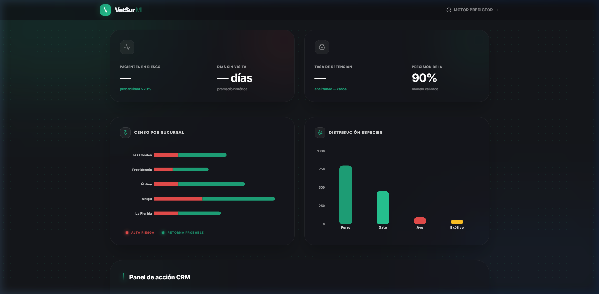
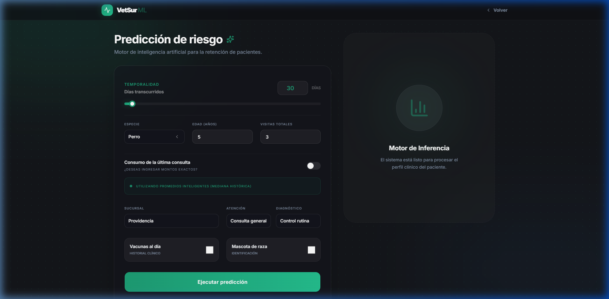

# 🐾 Vetsur: inteligencia de negocios y predicción de pacientes

<div align="center">

[](https://nextjs.org/)
[](https://fastapi.tiangolo.com/)
[](https://www.docker.com/)
[](https://scikit-learn.org/)
[](https://www.typescriptlang.org/)

### 🚀 [Acceder a la plataforma en vivo](https://vetsur.gbkjy.dev)

</div>

---

## El desafío del negocio
> **Nota:** Este proyecto es un **ejercicio académico** basado en un caso de estudio para Vetsur Servicios Veterinarios SpA.

A pesar de facturar aprox. $2.800 millones anuales, Vetsur operaba con sistemas locales (VetManager) y silos de información. Rodrigo Maturana, el fundador, carecía de visibilidad sobre la rentabilidad real de cada sede y el desempeño de los 47 empleados. 

## Vista del dashboard
<p align="center">
  
</p>

## Proceso de ingeniería de datos (ETL)
No se optó por la eliminación de registros, sino por una reconstrucción lógica documentada en nuestro pipeline:
- **Normalización automatizada:** implementación de la librería `ftfy` para reparar la doble decodificación corrupta en variables categóricas.
- **Imputación estadística:** uso de la **mediana** como medida robusta frente a los valores atípicos (outliers) encontrados en cirugías de alto costo.
- **Refactorización de esquema:** evolución de un esquema estrella a un **esquema de galaxia**, separando los hechos de atención (`FACT_ATENCION`) de los movimientos de inventario (`FACT_INVENTARIO`).

<p align="center">
  
  <br>
  <em>Diagrama de modelado: separación de hechos de atención e inventario compartiendo dimensiones clave.</em>
</p>

## Modelado y hallazgos analíticos
Evaluamos regresión lineal y gradient boosting, pero el ganador indiscutible fue **Random Forest**.

### Métricas clave del modelo
- **Precisión (accuracy):** 86%.
- **Exhaustividad (recall):** 91%. Priorizamos el recall para minimizar los falsos negativos, ya que para Vetsur es más costoso perder un cliente en peligro de fuga que realizar un contacto preventivo innecesario.

<p align="center">
  
</p>

## Arquitectura del sistema (stack pro)
Diseñamos una infraestructura de microservicios para producción real:

- **Backend (FastAPI):** motor de inferencia en Python que carga el Random Forest serializado.
- **Frontend (Next.js & TypeScript):** interfaz reactiva con filtros dinámicos por sucursal y riesgo.
- **Infraestructura cloud:**
    - **Contenerización:** arquitectura orquestada con Docker Compose (API + Front + Nginx).
    - **Proxy inverso:** Nginx gestionando el enrutamiento y la seguridad SSL.
    - **VPS (DigitalOcean):** despliegue en un Droplet escalable.

## Ejecución local
Clone el repositorio y levante el ecosistema completo con Docker:
```bash
docker-compose up -d --build
```
La plataforma se levantará automáticamente en el puerto 3000. 
